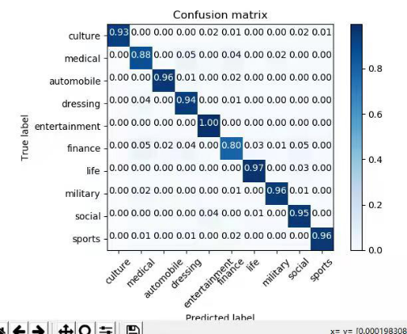
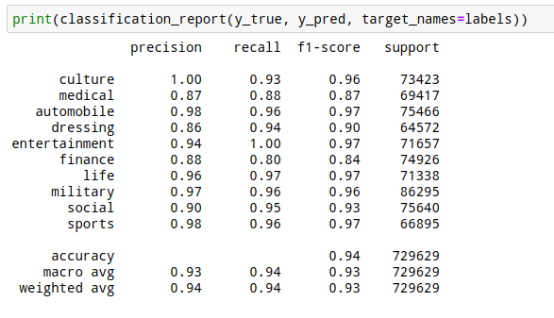
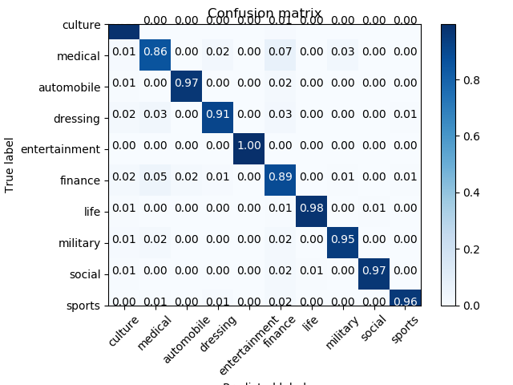

# text-classification
一百万中文文本分类

从搜狐上爬取1042326篇新闻文本，其中包含10个类别：automobile、culture、dressing、entertainment、finance、life、medical、military、social、sports，每类包含十万篇文本左右，对训练集和测试集以 3:7 的比例划分进行文本分类。

文本格式如下所示

```
content:春运高峰，各航空公司为缓解运力紧张，在部分航线增设了夜间飞行的“红眼航班”。据白云机场商旅公司方面介绍，目前各家公司已经在3条航线上增设了14个航班的“红眼航班”，其中包括广州至长沙的9个航班，广州至武汉的4个航班，以及广州至海口的1个航班。 (记者吕楠芳、通讯员詹姣妍报道)
```

## 数据预处理

### 0.split_word.py——分词

遍历所有类别文件夹读取所有文件路径，每一类用一个 list 表示，list 中存储每篇文章的路径。根据路径读取每个文件，并用 jieba 进行分词、停用词处理和词性标注。

```python
file_lists = []  # 保存文本路径

folder = os.walk(finance)  # 要填
for path, dir_list, file_list in folder:
    for file_name in file_list:
        file_lists.append(os.path.join(path, file_name))
```

```python
"""
分词、取名词等属性
"""
stop_words = '../数据预处理/stop_words.txt'
userdict = '../数据预处理/userdict.txt'
category_data = []  # 类别所有数据
count = 0 # 统计处理了多少文本
for article_path in file_lists:

    with open(article_path, 'r') as f:
        article = f.read()  # str

    # 加载停用词表
    stop = [line.strip() for line in open(stop_words).readlines()]

    # 导入自定义词典
    jieba.load_userdict(userdict)

    words = jieba.posseg.cut(article)  # 生成器对象
    word_attribute = ['n', 'ng', 'nr', 'ns', 'nt', 'nt', 'nz',
                      'v', 'vg', 'vd', 'vi', 'vn', 'a', 'm']  # 词语属性

    split_words = []  # 一篇文章的分词结果
    for word in words:
        if word not in stop:  # 去停用词
            for attribute in word_attribute:
                if word.flag == attribute:
                    split_words.append(word.word)
                    break

    if len(split_words) > 0:  # 分词长度不为 0 则添加该篇文本
        category_data.append(" ".join(split_words))

    print(count)
    count = count + 1
```

将该文本所有名词（动词等）用空格分隔拼接成一个字符串，如`新品 口碑 产品 护肤 效果 附件 日本 贵妇 品牌 肌肤 之匙 时候 附件 肌肤 黄金 闺蜜 价格 太值 质地 有点 附件 樱桃 样子`。分别用两个 list 存储每个文本分词后的结果以及对应的 label，用 pickle 存储文本数据和对应的标签，最后将每类文本对应的字符串和标签合并并保存。

```python
label = ['finance'] * len(category_data)  
cate_file = '../pre_processed_data/finance_plus_vam_stopwords.pkl'  
with open(cate_file, 'wb') as f:
    pickle.dump(category_data, f)
    pickle.dump(label, f)
```

各类数据集处理前后大小（若文本分词后为空则舍弃该文本）

culture：99999 个  有效 99538 个

medical：101847 个 有效 101839 个

automobile：106000 个 有效 104827 个

dressing：107592 个 有效 107592 个

entertainment：92248 个 有效 92240 个

finance：102100 个 有效 102082 个

life：107613 个 有效 107287 个

military：123161 个 有效 123096 个

social：108226 个 有效 108207 个

sports：95612 个 有效 95613 个

处理前总数据：**1,044398** 个

处理后总数据：**1,042,321** 个

### 1.concat_data.py——拼接

读取每一类的数据拼接起来构成十个类别总的数据和对应的标签

```python
def concat_data(data, label, cate):
    cate_path = '../pre_processed_data/%s.pkl' % cate
    with open(cate_path, 'rb') as f:
        cate_data = pickle.load(f)
        cate_label = pickle.load(f)
    print('%s读取完毕' % cate)
    data.extend(cate_data)
    label.extend(cate_label)
    print('%s添加完毕' % cate)
```

### 2.train_model.py——模型训练

对数据集进行随机划分，训练集占3成，测试集占7成。划分后训练集数量为312697，测试机数量为729629。对于分词后的每一篇文档，用词袋模型进行训练，提取文档的特征，转换为特征向量为之后的分类器提供输入。

```python
x_train, x_test, y_train, y_test = train_test_split(data, label, random_state=42, test_size=0.7)


bow = CountVectorizer()

print(len(x_train))  # 312697
print(len(x_test))  # 729629

x_train = bow.fit_transform(x_train)  # csr_matrix (312697, 616910)
x_test = bow.transform(x_test)  # csr_matrix (729629, 616910)
```

使用朴素贝叶斯算法对训练后的词向量进行分类，为了找到最好的模型，选用 `GridSearchCV` 类进行交叉验证对模型参数进行调整并自动选择最优参数。

```python
"""
GridserachCV 调参
"""
vec_name = 'bow_finance_plus_vam_gridsearchCV_37'

train_starttime = datetime.datetime.now()
parameters = {'fit_prior': [True, False], 'alpha': np.logspace(-5, 1, num=10, base=2)}
grid_search = GridSearchCV(MultinomialNB(), parameters)
grid_search.fit(x_train, y_train)
train_endtime = datetime.datetime.now()

test_starttime = datetime.datetime.now()
y_pred = grid_search.predict(x_test)
test_endtime = datetime.datetime.now()

score = grid_search.score(x_test, y_test)
train_time = train_endtime - train_starttime
test_time = test_endtime - test_starttime
```

### 3.result_judge.py——结果评判

通过混淆矩阵查看每一类分类的正确性，通过查看准确率、召回率和 f1 值评判分类结果好坏。





最终朴素贝叶斯最好结果（score）是 0.9365

### 其他

此外用 xgboost 进行分类，最终得到的结果为 0.9467，但训练时间过长。



使用腾讯 word2vec 预训练模型对分出来的词进行词向量表示，最后用朴素贝叶斯分类效果并不好，只有 0.8143

Tfidf 效果并没有词袋模型效果好


